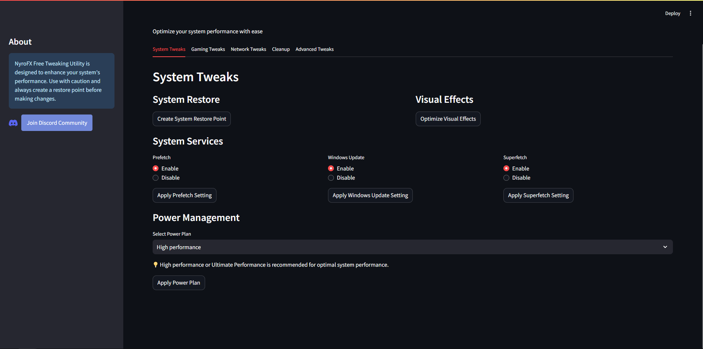

# NyroFX Free Tweaking Utility

## 🚀 About
NyroFX Free Tweaking Utility is a lightweight, web-based app built with **Streamlit**. It provides PC optimization and gaming tweaks to help reduce input delay and improve system performance.

## ✨ Features
- **PC Optimization**: Boost overall performance.  
- **Gaming Tweaks**: Reduce input delay for a smoother experience.  
- **Simple Interface**: Easy to use for anyone.

## 📥 How to Deploy Locally
1. **Clone the repository**:  
   ```bash
   git clone https://github.com/yourusername/nyrofx-tweaking-utility.git
   ```

2. **Navigate to the project directory**:  
   ```bash
   cd nyrofx-tweaking-utility
   ```

3. **Install required dependencies**:  
   Ensure you have Python installed. Install Streamlit:  
   ```bash
   pip install streamlit
   ```

4. **Run the app**:  
   ```bash
   streamlit run Nyrofx_free_tweaking_utility.py
   ```

5. Open the provided local URL in your browser (e.g., `http://localhost:8501`).

## 🖼️ Preview


## 🤝 Contributions
Contributions are welcome! Feel free to fork the repository and submit a pull request.

## 📧 Contact
- **Discord**: [https://discord.gg/4aT28zYy](https://discord.gg/4aT28zYy)
